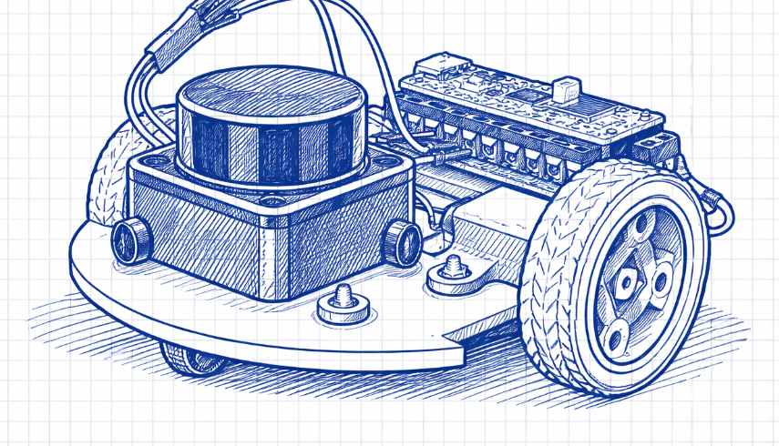

# PiDAR
An autonomous robot that builds a real-time 2D map of an unknown room using LiDAR and SLAM, with live visualization and path tracking.

## A little context
I've always wanted to learn more about LiDARs and autonomous vehicles. This project will also serve as one of my projects for the online portion of the *Stasis* Hackathon, a Hack Club event.

